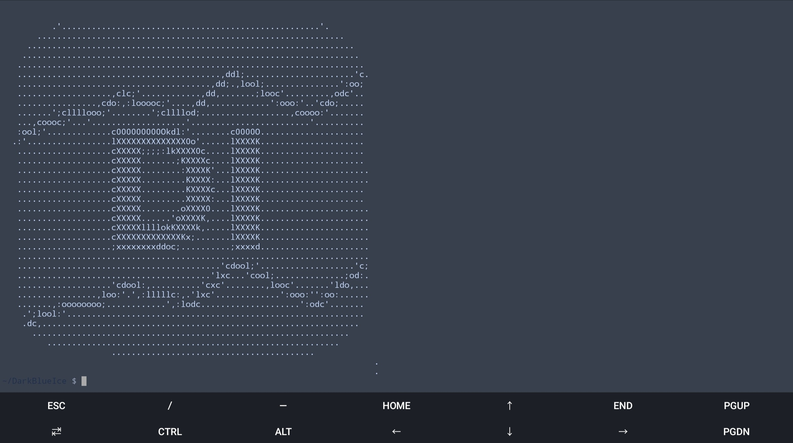

## DarkBlue Ice for termux



### A Beautiful theme for termux with dark blue and ice colors distributed in a harmonic way. 

---

## Install

* Download the `colors.properties` on [github releases](https://github.com/Dedsd/DarkBlue-Ice-for-termux/releases)
* Add the file to downloads on termux
* Move the file to .termux:

```
mv colors.properties ~/.termux
```

* Reload termux settings:

```
termux-reload-settings
```

---

Made by [Enso😁](https://github.com/ennso)
